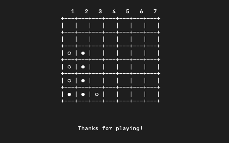

# Connect 4 Terminal Application

A Terminal Application of the popular Connect 4 game

Created by Gabriel Wong for a project with Coder Academy 

## Instructions and Help

### System Requirements

In order to run this application, the user will preferably be running on a *nix based operation system (i.e. MacOS or Linux). However, Windows is supported due to the cross-platform nature of Python 3, however, was not tested on.

### Python 3

The application requires Python 3 to be installed on your machine. To check if it is installed, you can enter the following command:

```
which python3
```
or

```
python3 --version
```

If you need to install Python 3, you can download the latest Python 3 version at [https://www.python.org/downloads/](https://www.python.org/downloads/ "https://www.python.org/downloads/").

### Dependencies

The numpy module will need to be installed before running this application. It can be obtained by running the following command in your terminal:

```
pip install numpy
```

### How to Install

Download the main.py file, navigate to the directory where the game is located in a terminal and run with Python 3, as per the following command:

```
python3 main.py
```

### Application Features

* **Realistic Connect 4 Board User Interface** - The game application has a stylish and minimal board UI design. This is to create a relaxing environment for players to play connect 4. The board comes with a numbered 1-7 row at the top of the board to help players make their move.

* **Multiplayer game** - Allows for 2 players to play against one another. This is to encourage social interaction to combat social isolation during COVID19.

* **Drop piece in grid** - Players can make a move by inputting a column number. If a space is empty in that column, the players piece will be dropped into that position. 

* **Piece drop animation** - A piece drop animation is played before the piece is dropped into the grid. This is to simulate a piece falling into place like a real connect 4 game.

* **Clear board animation** - A clear board animation is played when the user decides to start a new game. This is to simulate the action when you pull out the slide bar in a real connect 4 board, and all the pieces drop through to the different levels and eventually fall out.

* **Checking for winning move** - When a player makes a move, the application will check if they have made a winning move i.e. they have 4 in a row horizontally, vertically or diagonally. If they have made a winning move, the application will announce them as a winner! It will then ask the user if they wish to play again.

* **Draw** - When there are no more empty spots left on the board, the application will announce that there is a draw. It will then ask the user if they wish to play again.

# Software Development Plan

## Statement of Purpose and Scope

### Description of application
My terminal application is the popular strategy board game Connect 4. Two players take it in turns dropping coloured checkers into a seven-column by six-row grid. The first player to align four of their checkers in a row (horizontally, vertically or diagonally) wins. My game is a multiplayer game and requires 2 people to play the game.

### The Problem my application will solve and Why I am developing this application
My game terminal application solves the problem of boredom and social isolation during the current COVID19 global pandemic. As there are a lot people in lockdown and cannot go out for safety reasons, my game serves to help people stay connected and entertained. Also playing strategy board games keep one’s mind alert and active. 

I wanted my Connect 4 terminal application to be as realistic as possible to the original Connect 4 game. This will hopefully make my application highly addictive, to keep people entertained, as per my terminal application purpose. 

Connect 4 is popular amongst young kids because it involves building things up (filling the grid with coloured checkers) and knocking things down (emptyingw the grid of checkers). This is why I created the piece drop animation and the clear board animation to provide my users with the same real life experience. The novelty of my animations will hopefully not wear off anytime soon.

### Target Audience
My target audience is anyone who is bored and wants to kill time, or they want to spend time with another person (either physically or virtually) playing an addictive game. This game is suitable for ages 6+. It is especially suitable for children as it’s relatively easy to pick up and understand the game mechanics. Each game takes approximately 1 to 10 minutes, so it’s great for players who want a short game that doesn’t go on for hours. 

My terminal game is unfortunately not designed for blind and/or deaf people. I may work on a connect 4 game that is more accessible to the blind and/or deaf in the future.

### How a member of target audience will use it
A user of my application can play against another person physically or virtually (through screen sharing via Zoom or Skype). One player will run the application and the other player will be able to see their screen (physically or virtually) and instruct the first player to make their moves for them.


## Features 

* **Creating a 6x7 connect 4 number grid, to keep track of the different pieces/game play**

The first feature I needed to develop to start my connect 4 terminal application game was creating a grid that could store empty spaces. To implement this, I used the NumPy python library which made working with arrays easy. I first imported Numpy by using the command  import numpy as np. I then created a function called create_board which initialised an array of 6 lists with 7 zeros in each list by using the command => board = np.zeros(6, 7), dtype=np.uint8. I then returned this board array.

* **Multiplayer game**

To make my game social, I made my connect 4 a multiplayer game i.e. you play against another player. To do this I utilised a while loop which would only end once the user decided to quit the game i.e. when they typed in “N” for No. If the user continued to play, i.e. type in “Y” for Yes, the while loop would continue. 

To allow for players to take it in turns, I created a variable called turn and set it to 1. If the turn is an odd number, it would be Player 1’s turn. If turn is an even number, it would be Player 2’s turn. Every time a player makes a move, turn is increased by 1. This is how I implemented the alternating of turns for each player.

* **Drop piece in grid**

The next feature I implemented was the drop piece in grid function. Once the player enters in a number, which corresponds to a column, the is_valid_location function is executed to see if there is at leat one space remaining in that column. If the column has an opening, the get_next_open_row function is executed to determine the next open row in the column. Then we would be able to execute the drop_piece function, which updates the board array with the player’s unique number/piece.
 
* **Checking for winning move**

Once I was able to have players taking it in turns to drop pieces in the grid, I needed to check for the winning condition i.e. if a player gets 4 checkers in a row (horizontally, vertically or diagonally). I did this by creating a new function called winning_move. The input to this function is the board array and the piece. 

The first part of the function  checks for any identical pieces that are horizontally 4 in a row i.e. if same piece is 4 in a row in a list.

The second part of the function checks for any identical pieces that are vertically 4 in a row i.e. if same piece is 4 in a row in same list spot.  

The third part of the function checks for for any identical pieces that are upward sloping diagonal 4 in a row i.e. if same piece is 4 in a row in same list spot.  

The fourth part of the function checks for any identical pieces that are downward sloping diagonal 4 in a row i.e. if same piece is 4 in a row in same list spot.  

* **Minimal & Stylish Connect 4 Board User Interface**

The numpy array matrix was great for storing data but was not the best board user interface for extended periods of time. As my game application’s purpose was to entertain people and keep them playing the game, I decided to create a more realistic board UI which would be more user friendly and inviting.

The new Grid User Interface differentiates the two players’ pieces by black and white. And the numpy zeros are represented by empty spaces, which was the best way to simulate a connect 4 grid in real life. I decided to add extra 1 to 7 row at the top, to guide players when making their moves.

* **Piece drop animation, to simulate a Connect 4 game**

When a piece is dropped into the grid, a piece drop animation is played on the board before the piece is allocated to the empty position. This simulates the real life connect 4 game when you drop a piece in the grid and you see the piece fall through the different levels before it reaches the available spot. The piece drop animation makes the game as realistic as possible to the real-life game.

* **Clear board animation, to simulate a Connect 4 game**

When connect 4 is achieved and the players decide to play a new game, a clear board animation is played to show the pieces being cleared out. Just like in the real life connect 4 game, when you pull out the slide bar to release all the checkers, the checkers filter through to the different levels and eventually fall out. The clear board animation makes the game as realistic as possible to the real-life game.


# User Interaction and Experience

My terminal game has been designed to be intuitive and relatively easy to pick up and play. The first screen of my program is shown below.

 

My introduction screen welcomes players to my terminal application game. It consists of a retro Connect 4 header which gives off a retro game vibe to users. Under the header, I provide a brief explanation on the game mechanics of connect 4, to help people who haven’t played the game before.

 

Once the user hits enter to continue, an empty board is displayed inviting Player 1 (White) to play their first turn. It provides a simple instruction on how Player 1 can make their move i.e. Enter in a number between 1 to 7. The number corresponds to the 7 different columns available on the board (as represented by the first row numbered 1 to 7).

 

We see here that Player 1 has typed in 4 and is about to hit enter.

 

Once Player 1 has hit enter, the piece drop animation is played before the piece drops into the bottom row. It will now be Player 2’s turn and the program will prompt them to enter in a number between 1-7 to make their move.

 

We can see here that Player 2 has entered in 5 and their piece has dropped to the bottom row of the fifth column. 

The game will continue until the first player connects 4 in a row (see 4 different scenarios below). Once this condition is met, the winner will be announced, and the user asked whether to want to play again. The user can either enter Y to restart the game, or they can enter N to exit the game. If the user enters in Y, a clear board animation is shown (with the pieces falling out of the grid) and a new empty board is created for the players to play again. If they enter in N, the message “Thanks for Playing” is printed and the game ends.

 

 

Player 1 wins vertically.

 

Player 1 wins horizontally.

 

Player 2 wins upward sloping diagonally.

 

Player 1 wins downward sloping diagonally.

 

In the scenario where no player has achieved a connect 4 and the board is filled, a draw is announced. The program will then ask the user if they want to play the game again.

My program handles the following errors as shown below.

 

On the player input screen, if a player enters in a number that is not between 1 and 7, it will print a message saying this is not a valid number. If a player enters in non-integer character instead of an expected integer value, the value error will be caught, and the following message shown to the player “This is not a number”. 

 

On the play again screen, if a player enters in a character that is not Y or N, it will print a message that says, “This is not a valid letter”. If a player enters in a non-alphabet value (such as an integer or float), the value error will be caught, and the following message shown to the player “This is not a valid letter”. 

# Control Flow Diagram

 

# Implementation Plan

Due to the 1 Week time constraint, I needed to have an implementation plan that would allow me to finish my connect 4 game and meet the documentation requirements. I decided to use Trello as a project management software to keep track of my application development.

The main features that I included on my implementation plan are as follows:

1.	Creating an empty board and keeping track of the different pieces on the board when players make a move
    1. Finding the most optimal way to create a nested list which contains zeros.
2.	Main Game Process (Alternate turns between Player 1 and Player 2)
    1. Creating the main game loop to continue until the user enters N to exit the program
    1. Providing a player with the ability to input a column input
    1. Drop piece in board
    1. Ability to check if specified column has at least one spot available to help drop piece function.
    1. Ability to determine the next available row in the specified column to help drop piece function.
    2. Ability to update board’s nested list with a player’s piece (i.e. allocate and drop piece in available spot) to finalise player’s move.
3.	Checking for winning move
    1.	Checking for horizontal connect 4 winning move board state
    1.	Checking for vertical connect 4 winning move board state
    1.	Checking for upward sloping diagonal connect 4 winning move board state
    1.	Checking for downward sloping diagonal connect 4 winning move board state
4.	Minimal and stylish Connect 4 board User Interface
    1.	Displaying the board in a more visually appealing way than the nested list of numbers
    1.	Centring the board, messages and input prompt on the screen to make it more visually appealing
    1.	Figuring out how to print two different coloured pieces on a single line to make the game more realistic
    1.	Deciding on whether to have different coloured pieces or have black and white pieces only
5.	Piece drop animation
    1.	Figuring out how to display a piece being dropped from the top of the board and falling into the available position.
6.	Clear board animation
    1.	Figuring out how to move existing player pieces from one row to another over time, to simulate pieces dropping in real life.
7.	Adding in an Introduction screen to brief new players on how to play the game
8.	Error handling
    1.	How to handle errors for player move/column input when number entered is not between 1 to 7 and non-integers
    1.	How to handle errors for player input when Y or N is not entered or non-alphabet value is entered
9.	All the Documentation
    1.	Software development plan
    1.	Control flow diagram
    1.	Testing spreadsheet
    1.	Help file
    1.	Implementation plan

# Testing

Manual testing for my application was completed by myself, peers and Lead Educator Garret. My results for the tests were recorded in a Manual Program Testing Spreadsheet as below:

